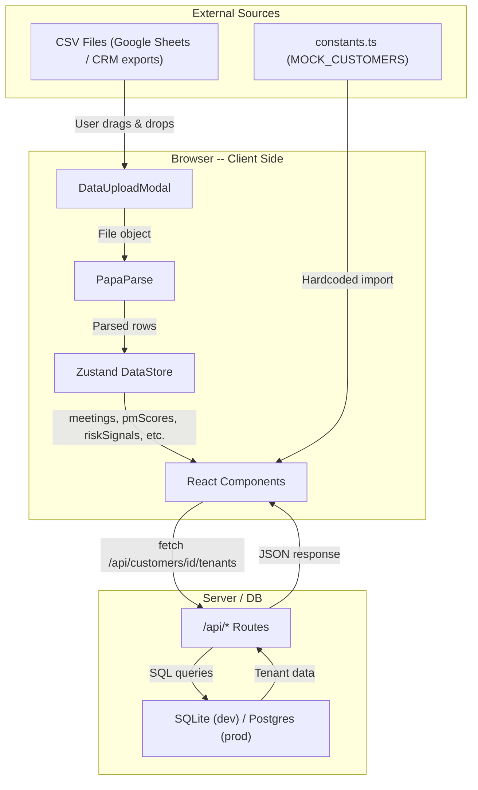

# CCS Intelligence Dashboard (Pulse CS) -- Current State & Vision

---

## 1. Application Purpose

Pulse CS, the internal Customer Success Intelligence Dashboard for Alo-Tech / CallCenterStudio teams. The application serves as a single pane of glass for Customer Success Managers to:

- Track account health, MRR, churn risk, and touch status across the customer portfolio
- Analyze meeting intelligence: PM performance scores, customer sentiment, pain points, and risk signals (all derived from AI-processed meeting transcripts exported as CSVs)
- Monitor sales pipeline: live orders, setup/hold pipeline, PM workload, and overdue orders
- Manage tenant information (CRM-like CRUD with CSV import)
- View knowledge base patterns: recurring issues, FAQ trends, feature demands, documentation gaps

**Who uses it:** Customer Success, Account Management, and Operations teams at Alo-Tech and CallCenterStudio.

**Access:** Google sign-in via Clerk, restricted to `@alo-tech.com` and `@callcenterstudio.com` email domains. Admin panel access is further restricted to emails listed in `VITE_ADMIN_EMAILS`.

---

## 2. Current User Experience (UI/UX)

### 2.1 Login

- Clerk-powered Google sign-in
- Domain-restricted: only `@alo-tech.com` and `@callcenterstudio.com` are allowed
- Unauthorized domains are automatically signed out
- Turkish UI copy on the sign-in screen

### 2.2 Main Layout

The application uses a fixed sidebar + scrollable main content layout:

```
+------------------+---------------------------------------------+
|                  |  Header: Page title, Update Data btn,       |
|  Sidebar (dark)  |  notification bell, user avatar/sign-out    |
|                  |---------------------------------------------+
|  - Dashboard     |                                             |
|  - All Accounts  |  Content area (scrollable)                  |
|  - Meeting Intel |                                             |
|  - Sales Orders  |                                             |
|  - Admin*        |                                             |
|                  |                                             |
|  Settings        |                                             |
+------------------+---------------------------------------------+
```

**Sidebar badges:**
- Meeting Intel: red dot when any account has `churn_risk === 'high'`
- Sales Orders: red count badge showing number of overdue pipeline orders

**Header:**
- "Update Data" button opens DataUploadModal (7-slot CSV upload)
- Green dot on the button when any CSVs have been uploaded
- Notification bell icon
- User avatar with hover dropdown for sign-out

### 2.3 Tab-by-Tab Walkthrough

#### Dashboard (Weekly Overview)

The default landing page. Currently shows:

| Section | Content | Data Source |
|---------|---------|-------------|
| Stats Cards (4) | Total MRR, Touch Rate (MRR + Count), Onboarding Count, At Risk Count | `MOCK_CUSTOMERS` (hardcoded) |
| Weekly Touch Status | Bar chart: Touched vs Untouched | `MOCK_CUSTOMERS` |
| Account Health Overview | Pie chart: Onboarding / Active / At Risk / Churned | `MOCK_CUSTOMERS` |
| Urgent Actions | List of onboarding bottlenecks and at-risk customers | `MOCK_CUSTOMERS` |
| Onboarding Pipeline | Table: Client, Route, Products, Timeline, Progress bar | `MOCK_CUSTOMERS` |
| Historical Implementations | Monthly go-live cards with MRR totals | `MOCK_CUSTOMERS` |
| Intelligence Highlights | High Churn Risk count, Upsell Opportunities count, Recurring Issues count + Recent High-Risk Meetings table | `useDataStore` (CSV uploads) -- only shown when meeting data exists |

The Intelligence Highlights section at the bottom is the only part that uses real uploaded data. Everything above it is driven by 6 hardcoded mock customers.

#### All Accounts

- Search bar (name/domain) + status filter dropdown (All, Onboarding, Active, At Risk)
- Table columns: Customer, Status badge, MRR, Touch Status (green/amber dot), Health (progress bar or score)
- Clicking a row opens the CustomerDetail slide-over
- **Data source:** `MOCK_CUSTOMERS` -- always shows the same 6 entries

#### Meeting Intelligence (5 sub-tabs)

Requires CSV upload to show data; otherwise shows EmptyState with upload prompt. Loading skeletons appear during parsing.

| Sub-tab | Key UI Elements | Data Source |
|---------|-----------------|-------------|
| **Overview** | 4 KPI cards (meetings this month, hours, AI processed rate, avg PM score), weekly volume bar chart, meeting type pie chart, most active accounts table | `useDataStore` -- meetings, pmScores, customerInsights, riskSignals |
| **PM Performance** | PM avatar selector, radar chart (5 axes), score trend line chart, English proficiency bars, meeting load stacked bar, PM comparison table with sortable columns | `useDataStore` -- pmScores, meetings |
| **Customer Intel** | Account search/filter, sentiment table, account detail drawer (4 tabs: Pain Points, Needs & Requests, Meeting History, PM Match), pain point category bar chart, feature demand mapping | `useDataStore` -- customerInsights, meetings, pmScores |
| **Risk & Churn** | Risk KPI cards, churn vs escalation scatter matrix with reference areas, high-risk accounts list with "View Details" button, upsell opportunities table, churn trend line chart | `useDataStore` -- riskSignals, meetings |
| **Knowledge Base** | Recurring issues list, FAQ patterns, feature demands, documentation gaps, topic trend chart | `useDataStore` -- knowledgeItems |

**Cross-tab interaction:** "View Details" in Risk & Churn opens the account detail drawer in Customer Intel tab.

#### Sales Orders

Requires CSV upload; otherwise shows EmptyState.

| Section | Content |
|---------|---------|
| KPI Cards (4) | Live Orders (Active) count + total, Pipeline Orders count + total, Setup count, Hold count |
| Filters | PM dropdown, Status (All/Setup/Hold), text search |
| Two-column Tables | Active (Live) and Pipeline (Setup/Hold) -- paginated with "Load more", sortable by grand total |
| PM Workload Chart | Composed chart: bars for live/pipeline count per PM, line for total amount |
| Recent Activity Timeline | Last 30 days of order creation events |

#### Admin (admin-only)

- Tenant management: table with CRUD actions (edit, delete, toggle active)
- CSV import for bulk tenant upload
- Visible only to emails in `VITE_ADMIN_EMAILS`

### 2.4 CustomerDetail Slide-over

Opens as a right-side panel when clicking an account row. Structure:

```
+----------------------------------------------------------+
|  <- Back to List                                         |
|----------------------------------------------------------|
|  Customer Name                          Health Score [88] |
|  Tenant info (from DB)                                   |
|  Status badge | Segment | $MRR/mo | Contract end        |
|----------------------------------------------------------|
|  4 metric cards:                                         |
|  Churn Risk | Satisfaction | Open Tickets | SLA Score    |
|----------------------------------------------------------|
|  Technical Issues panel (or "No issues" banner)          |
|----------------------------------------------------------|
|  [Overview] [Tickets] [Notes] [Onboarding] [Meeting Intel]
|                                                          |
|  Tab content area                                        |
+----------------------------------------------------------+
```

| Tab | Content | Data Source |
|-----|---------|-------------|
| Overview | Account summary (MRR, Health, Renewal), engagement status | `MOCK_CUSTOMERS` |
| Tickets | 7-day ticket trend area chart, avg response/resolution times | `MOCK_CUSTOMERS.zohoStats` |
| Notes | Latest account note with timestamp and manager | `MOCK_CUSTOMERS.notes` |
| Onboarding | Dark card: dates, stage, progress bar, bottleneck alert | `MOCK_CUSTOMERS.onboarding` |
| Meeting Intel | Last sentiment + badge, last 3 meetings timeline, top 3 pain points, upsell opportunities, latest PM feedback | `useDataStore` (matched by `customer.name` or `customer.domain`) |

The Meeting Intel tab is the only tab that pulls from uploaded CSV data. All other tabs show mock data.

### 2.5 DataUploadModal

Full-screen modal with 7 drag-and-drop slots for CSV files:

| Slot | File Type | Store Target |
|------|-----------|--------------|
| Meetings Master | Meeting records from Google Sheets | `meetings` |
| PM Scores | PM performance evaluations | `pmScores` |
| Customer Insights | Sentiment, pain points, feature requests | `customerInsights` |
| Risk Signals | Churn/escalation risk, upsell/cross-sell signals | `riskSignals` |
| Knowledge Base | Recurring issues, FAQ patterns, doc gaps | `knowledgeItems` |
| Sales Pipeline (Setup/Hold) | Pipeline orders in setup or hold status | `pipelineOrders` |
| Sales Live Orders | Active/live orders | `liveOrders` |

**Responsive:** 1-column on mobile, 2-column grid on tablet+

Each slot shows upload status (file name, row count, green checkmark), with re-upload capability on hover. Parsing progress triggers loading skeletons in the target views.

---

## 3. Architecture

### 3.1 Tech Stack

| Layer | Technology |
|-------|-----------|
| Framework | React 19 + TypeScript |
| Build | Vite 6 |
| Styling | Tailwind CSS |
| Charts | Recharts 3 |
| State | Zustand 5 |
| CSV Parsing | PapaParse 5 |
| Auth | Clerk (Google OAuth) |
| Icons | Lucide React |
| DB (dev) | SQLite via better-sqlite3 |
| DB (prod) | Vercel Postgres |
| Hosting | Vercel |

### 3.2 Folder Structure

```
customer-success-pulse/
├── App.tsx                         # Root component, sidebar, routing
├── index.tsx                       # Entry point, Clerk provider
├── types.ts                        # Customer, ZohoDeskStats, etc.
├── constants.ts                    # MOCK_CUSTOMERS (6 hardcoded accounts)
├── components/                     # Original/legacy components
│   ├── DashboardOverview.tsx
│   ├── CustomerTable.tsx
│   ├── CustomerDetail.tsx
│   ├── SignIn.tsx
│   └── admin/
│       ├── AdminPanel.tsx
│       ├── TenantTable.tsx
│       └── TenantUpload.tsx
├── hooks/
│   ├── useEmailDomainCheck.ts
│   └── useAdminAccess.ts
├── src/                            # New module architecture (Iteration 1-8)
│   ├── types/
│   │   ├── meeting.types.ts        # MeetingMaster, PMScore, CustomerInsight, RiskSignal, KnowledgeItem, etc.
│   │   └── sales.types.ts          # SalesOrderPipeline, SalesOrderLive
│   ├── store/
│   │   └── dataStore.ts            # Zustand store (meetings, sales, parsing flags)
│   ├── lib/
│   │   ├── csv-parser.ts           # 7 CSV parsers (PapaParse wrappers)
│   │   └── meeting-parsers.ts      # JSON field parsers, normalization, aggregation
│   └── components/
│       ├── shared/
│       │   ├── DataUploadModal.tsx
│       │   ├── EmptyState.tsx
│       │   ├── ErrorBoundary.tsx
│       │   └── SkeletonCard.tsx
│       ├── meeting-intelligence/
│       │   ├── MeetingIntelligenceLayout.tsx
│       │   ├── MeetingOverview.tsx
│       │   ├── PMPerformance.tsx
│       │   ├── CustomerIntelligence.tsx
│       │   ├── RiskDashboard.tsx
│       │   └── KnowledgeBase.tsx
│       └── sales/
│           ├── SalesOrdersLayout.tsx
│           └── SalesOrders.tsx
├── lib/
│   ├── db.ts                       # DB connection (SQLite dev / Postgres prod)
│   ├── db-local.ts                 # SQLite implementation
│   └── csv-parser.ts               # Legacy tenant CSV parser
├── api/                            # Vercel serverless API routes
│   ├── init-db.ts
│   ├── tenants/
│   │   ├── index.ts                # GET list, POST create
│   │   ├── [id].ts                 # PUT update, DELETE
│   │   ├── import.ts               # POST bulk CSV import
│   │   └── add-to-customers.ts     # POST tenant-customer mapping
│   └── customers/
│       └── [id]/
│           └── tenants.ts          # GET tenants for a customer
├── vercel.json
├── vite.config.ts
└── .env.example
```

### 3.3 Data Flow



**Key observation:** Two completely separate data pipelines exist:
1. **Mock pipeline:** `constants.ts` -> `App.tsx` -> `DashboardOverview`, `CustomerTable`, `CustomerDetail` (props)
2. **CSV pipeline:** CSV files -> `PapaParse` -> `Zustand store` -> Meeting Intel, Sales Orders, Intelligence Highlights, CustomerDetail Meeting Intel tab (hooks)

### 3.4 Database Schema (current)

Only two tables exist, both for tenant management:

```sql
-- Tenants table
CREATE TABLE tenants (
  id SERIAL PRIMARY KEY,
  tenant_name VARCHAR(255) NOT NULL,
  account VARCHAR(255) NOT NULL,
  tenant_owner VARCHAR(255),
  is_active BOOLEAN DEFAULT true,
  created_at TIMESTAMP DEFAULT NOW(),
  updated_at TIMESTAMP DEFAULT NOW(),
  UNIQUE(tenant_name, account)
);

-- Customer-tenant mapping (customer_id references MOCK_CUSTOMERS.id, not a DB table)
CREATE TABLE customer_tenant_mapping (
  id SERIAL PRIMARY KEY,
  customer_id VARCHAR(255) NOT NULL,
  tenant_id INTEGER REFERENCES tenants(id) ON DELETE CASCADE,
  created_at TIMESTAMP DEFAULT NOW(),
  UNIQUE(customer_id, tenant_id)
);
```

There is **no `customers` table**. The `customer_id` in `customer_tenant_mapping` refers to mock customer IDs from `constants.ts`.

### 3.5 API Routes

| Endpoint | Method | Purpose |
|----------|--------|---------|
| `/api/init-db` | POST | Initialize DB schema |
| `/api/tenants` | GET | List all tenants |
| `/api/tenants` | POST | Create a single tenant |
| `/api/tenants/[id]` | PUT | Update tenant |
| `/api/tenants/[id]` | DELETE | Delete tenant |
| `/api/tenants/import` | POST | Bulk CSV import |
| `/api/tenants/add-to-customers` | POST | Map tenants to customers (using mock customer IDs) |
| `/api/customers/[id]/tenants` | GET | Get tenants for a customer |

### 3.6 Authentication & Authorization

| Mechanism | Implementation |
|-----------|---------------|
| Auth provider | Clerk (`@clerk/clerk-react`) |
| Sign-in method | Google OAuth only |
| Domain restriction | `useEmailDomainCheck` -- only `@alo-tech.com`, `@callcenterstudio.com` |
| Admin access | `useAdminAccess` -- emails in `VITE_ADMIN_EMAILS` env var |

---

## 4. Data Source Map -- MOCK vs REAL

| Data | Source | Persistence | Used By |
|------|--------|-------------|---------|
| **Customer list** (6 accounts) | `constants.ts` (hardcoded) | Code | Dashboard, All Accounts, CustomerDetail |
| **Account status** (Onboarding/Active/At Risk) | `constants.ts` | Code | Dashboard stats, pie chart, filters |
| **MRR** | `constants.ts` | Code | Dashboard Total MRR, CustomerDetail |
| **Touch status** | `constants.ts` | Code | Dashboard Touch Rate, CustomerTable |
| **Health score** | `constants.ts` | Code | Dashboard, CustomerDetail |
| **Zoho stats** (tickets, SLA) | `constants.ts` | Code | CustomerDetail Tickets tab |
| **Onboarding details** | `constants.ts` | Code | Dashboard Pipeline, CustomerDetail Onboarding tab |
| **Account notes** | `constants.ts` | Code | CustomerDetail Notes tab |
| **Tenants** | Database (SQLite/Postgres) | DB | Admin panel, CustomerDetail header |
| **Customer-tenant mapping** | Database | DB | CustomerDetail tenant display |
| **Meetings Master** | CSV upload -> Zustand | Browser memory (lost on refresh) | Meeting Intel Overview, Dashboard Intelligence Highlights |
| **PM Scores** | CSV upload -> Zustand | Browser memory | Meeting Intel PM Performance, CustomerDetail Meeting Intel tab |
| **Customer Insights** | CSV upload -> Zustand | Browser memory | Meeting Intel Customer Intel, CustomerDetail Meeting Intel tab |
| **Risk Signals** | CSV upload -> Zustand | Browser memory | Meeting Intel Risk & Churn, Dashboard Intelligence Highlights, sidebar badges |
| **Knowledge Items** | CSV upload -> Zustand | Browser memory | Meeting Intel Knowledge Base, Dashboard Intelligence Highlights |
| **Sales Pipeline Orders** | CSV upload -> Zustand | Browser memory | Sales Orders, sidebar badge |
| **Sales Live Orders** | CSV upload -> Zustand | Browser memory | Sales Orders |

### What is NOT persisted

All meeting intelligence data and sales order data exist only in the Zustand store (browser memory). When the user refreshes the page or opens a new tab, all uploaded CSV data is lost and must be re-uploaded.

---

## 5. Current Gaps and the Vision

### 5.1 Dashboard Tab -- Current vs Intended

The Dashboard is currently a disconnected view. The top sections (stats cards, charts, urgent actions, onboarding pipeline, historical implementations) all read from `MOCK_CUSTOMERS` -- 6 hardcoded entries that never change. Only the "Intelligence Highlights" section at the bottom connects to real uploaded data.

**The vision:** Dashboard should be the central command center, fed entirely by real data:

- **Stats cards** (Total MRR, Touch Rate, Onboarding Count, At Risk Count) should be computed from a real `customers` table in the database, not from `constants.ts`
- **Urgent Actions** should be driven by real churn signals -- accounts where `churn_risk === 'high'` from uploaded Risk Signals CSVs, combined with real account health data from the DB
- **Onboarding Pipeline** should show onboarding data from uploaded CSVs and tenant Excel data, not hardcoded progress bars
- **Account Health chart** should reflect real account statuses from the database

### 5.2 Account Data -- Missing Database Layer

Currently there is:
- No `customers` table in the database
- No `/api/customers` endpoint
- No way to create, update, or manage customers other than editing `constants.ts`

**The vision:** A proper `customers` table should store:
- Account name, domain, segment, MRR, contract dates
- Status (Onboarding, Active, At Risk, Churned) -- computed or manually set
- Touch status and health score -- either calculated from meeting frequency / risk signals or set via integration
- Zoho Desk stats -- ideally pulled from a Zoho API or imported

### 5.3 Data Persistence

All meeting intelligence and sales data currently lives only in Zustand (browser memory). A page refresh wipes everything, forcing users to re-upload all 7 CSVs.

**The vision:** Uploaded data should be persisted -- either:
- Server-side storage (DB) so data survives page refreshes
- Or at minimum, browser-side persistence (IndexedDB / localStorage) as a transitional solution

### 5.4 Gap Summary

| Gap | Current State | Intended State |
|-----|---------------|----------------|
| Customer data | 6 hardcoded entries in `constants.ts` | Real `customers` table in DB with CRUD API |
| Dashboard stats | Mock MRR, mock health, mock touch rate | Computed from DB + uploaded CSV data |
| Urgent Actions | Mock onboarding bottlenecks and at-risk flags | Real churn signals from Risk Signals CSV |
| Onboarding Pipeline | Hardcoded progress values | Data from CSVs + tenant Excel imports |
| CSV data persistence | Lost on page refresh (Zustand only) | Persisted in DB or browser storage |
| Account health | Static number in mock data | Calculated from meeting frequency, risk signals, ticket data |
| Tenant-customer link | Maps to mock customer IDs | Maps to real customer IDs in DB |

---

## 6. Component Map

### Root-level Components (`components/`)

| Component | File | Renders | Data Source |
|-----------|------|---------|-------------|
| DashboardOverview | `components/DashboardOverview.tsx` | Stats cards, charts, urgent actions, onboarding pipeline, historical implementations, intelligence highlights | Props: `MOCK_CUSTOMERS`; Store: `useDataStore` for intelligence section |
| CustomerTable | `components/CustomerTable.tsx` | Searchable/filterable account list table | Props: `MOCK_CUSTOMERS` |
| CustomerDetail | `components/CustomerDetail.tsx` | Slide-over with header, metrics, 5 tabs | Props: `MOCK_CUSTOMERS` item; API: `/api/customers/[id]/tenants`; Store: `useDataStore` for Meeting Intel tab |
| SignIn | `components/SignIn.tsx` | Clerk Google sign-in UI | Clerk |
| AdminPanel | `components/admin/AdminPanel.tsx` | Admin layout wrapper | -- |
| TenantTable | `components/admin/TenantTable.tsx` | Tenant CRUD table | API: `/api/tenants` |
| TenantUpload | `components/admin/TenantUpload.tsx` | Tenant CSV import UI | API: `/api/tenants/import` |

### New Module Components (`src/components/`)

| Component | File | Renders | Data Source |
|-----------|------|---------|-------------|
| DataUploadModal | `src/components/shared/DataUploadModal.tsx` | 7-slot CSV upload modal | File system -> PapaParse -> `useDataStore` |
| EmptyState | `src/components/shared/EmptyState.tsx` | Placeholder with icon, title, action | Props |
| ErrorBoundary | `src/components/shared/ErrorBoundary.tsx` | Error fallback with retry | Catches child errors |
| SkeletonCard | `src/components/shared/SkeletonCard.tsx` | Loading shimmer (card/table-row/chart) | Props |
| MeetingIntelligenceLayout | `src/components/meeting-intelligence/MeetingIntelligenceLayout.tsx` | Tab bar + sub-tab routing + empty state guard | `useDataStore.meetings` |
| MeetingOverview | `src/components/meeting-intelligence/MeetingOverview.tsx` | KPI cards, weekly volume, meeting types, top accounts | `useDataStore`: meetings, pmScores, customerInsights, riskSignals |
| PMPerformance | `src/components/meeting-intelligence/PMPerformance.tsx` | PM selector, radar, trends, English proficiency, workload, comparison table | `useDataStore`: pmScores, meetings |
| CustomerIntelligence | `src/components/meeting-intelligence/CustomerIntelligence.tsx` | Sentiment table, account drawer, pain point chart, feature demand | `useDataStore`: customerInsights, meetings, pmScores |
| RiskDashboard | `src/components/meeting-intelligence/RiskDashboard.tsx` | Risk KPIs, scatter matrix, high-risk list, upsell table, churn trend | `useDataStore`: riskSignals, meetings |
| KnowledgeBase | `src/components/meeting-intelligence/KnowledgeBase.tsx` | Recurring issues, FAQ, feature demands, doc gaps, topics | `useDataStore`: knowledgeItems |
| SalesOrdersLayout | `src/components/sales/SalesOrdersLayout.tsx` | Empty state guard + SalesOrders | `useDataStore`: liveOrders, pipelineOrders |
| SalesOrders | `src/components/sales/SalesOrders.tsx` | KPI cards, filters, live/pipeline tables, PM workload chart, timeline | `useDataStore`: liveOrders, pipelineOrders |

### Store

| File | Purpose |
|------|---------|
| `src/store/dataStore.ts` | Zustand store: meetings, pmScores, customerInsights, riskSignals, knowledgeItems, pipelineOrders, liveOrders, uploadedFiles, parsing flags, actions (setters, clearAllData) |

### Parsers & Utilities

| File | Purpose |
|------|---------|
| `src/lib/csv-parser.ts` | 7 async CSV parsers (PapaParse wrappers with header normalization) |
| `src/lib/meeting-parsers.ts` | JSON field parsers (pain points, upsell, feature requests, string arrays), bool/number normalization, PM score aggregation |
| `lib/csv-parser.ts` | Legacy tenant CSV parser |
| `lib/db.ts` | DB connection factory (SQLite dev / Postgres prod) |
| `lib/db-local.ts` | SQLite implementation (better-sqlite3) |

### Hooks

| File | Purpose |
|------|---------|
| `hooks/useEmailDomainCheck.ts` | Domain-based access control |
| `hooks/useAdminAccess.ts` | Admin role check via `VITE_ADMIN_EMAILS` |

---

*Document generated: March 2026*
